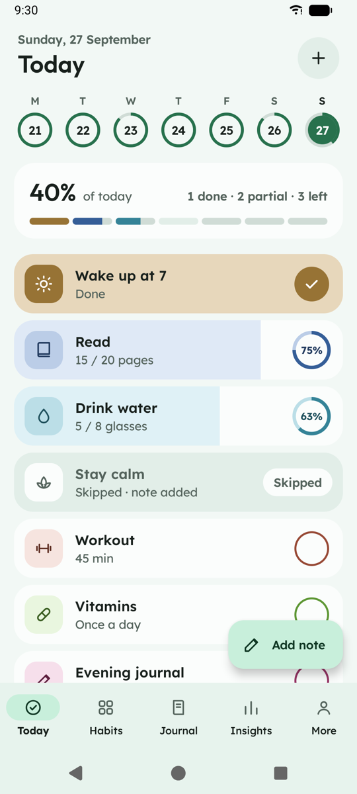
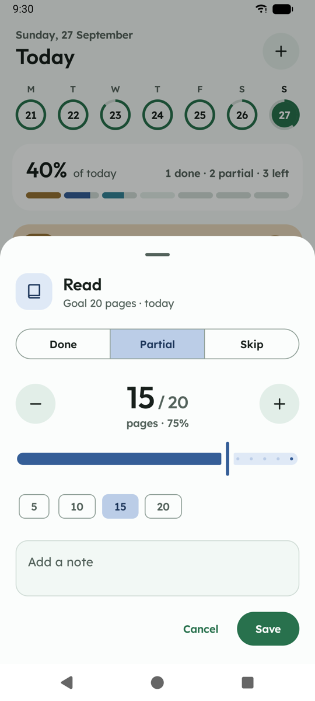
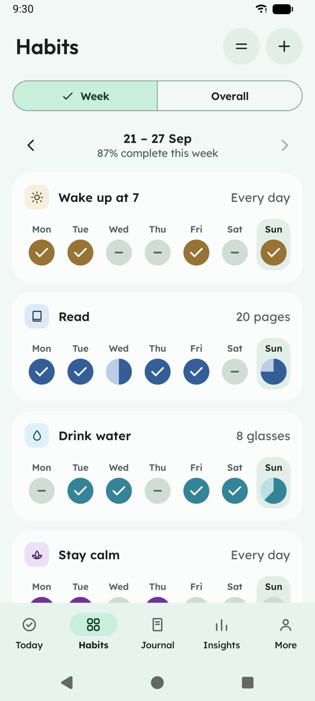
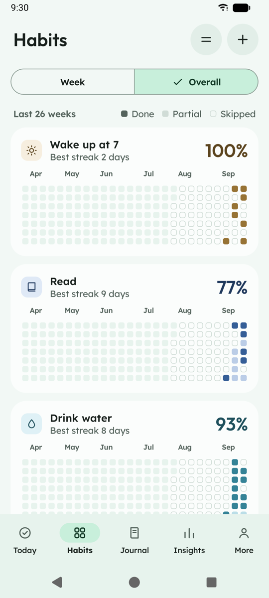
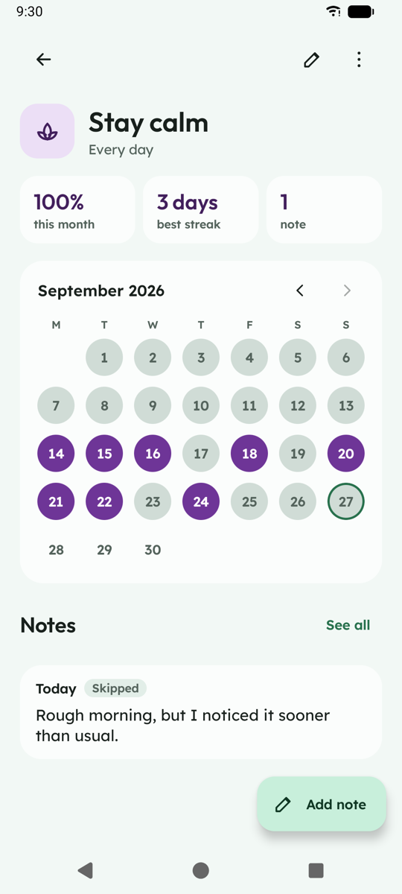
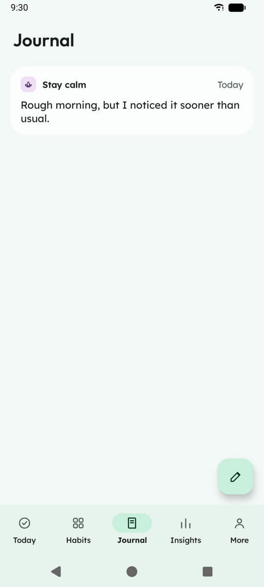
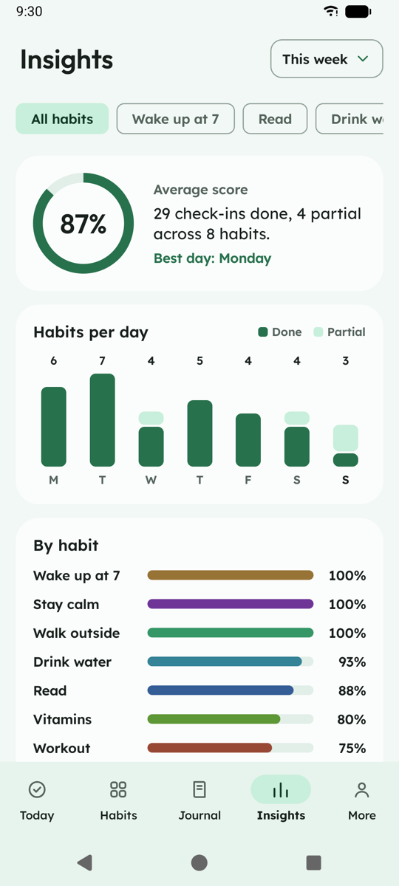
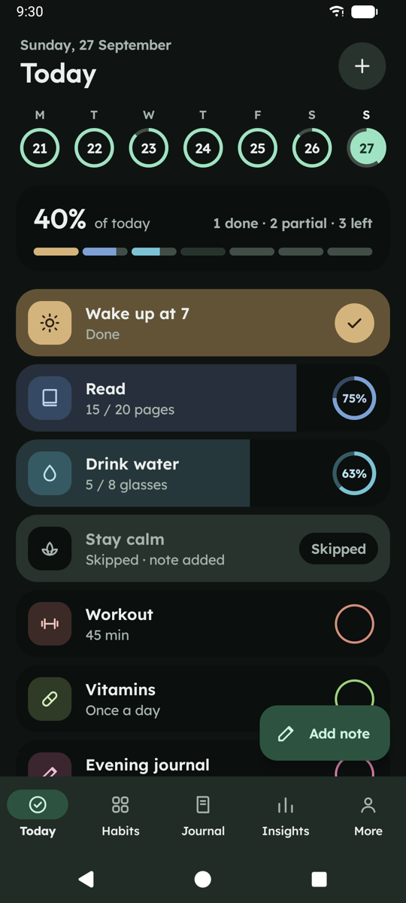

# Sprout

Sprout is a small, open-source habit tracker for Android. It keeps your habits and notes on your phone, works without an account, and the APK is under 3 MB.

| Today | Log an amount | Week | Overall |
| --- | --- | --- | --- |
|  |  |  |  |
| **Habit detail** | **Journal** | **Insights** | **Dark mode** |
|  |  |  |  |

More: [welcome](docs/screenshots/01-welcome.png), [new habit](docs/screenshots/10-new-habit.png), [settings](docs/screenshots/09-more.png).

## What it does

Each day, every habit is done, partly done (with an amount such as 15 of 20 pages) or skipped. Swipe right to mark a habit done, swipe left to skip it, tap its circle to toggle it, or press and hold to log an amount and add a note. Days you skip are left out of your score, so one bad day doesn't sink the week.

You can also:

- see each week at a glance, or the last 26 weeks as a heatmap, with scores and streaks
- keep a Journal of short notes tied to a habit and a day
- get a reminder at the time you pick, and a nudge in the evening to add a note when you skip a habit that asks for one
- add four home-screen widgets, including one that marks habits done from the home screen
- export everything, including your settings, to a JSON file and import it again, or export a CSV for spreadsheets
- choose light or dark, dynamic color from your wallpaper or an accent color, one of five fonts and a text size

[`docs/FEATURES.md`](docs/FEATURES.md) describes each feature in detail.

## Download

Signed APKs are attached to each [GitHub release](https://github.com/nisabmohd/sprout-habit-tracker/releases). There are two builds:

- `foss` has no Google or Play Services code and backs up to files only. This is the one for F-Droid.
- `play` will add Google Drive backup (not built yet, see [`TODO.md`](TODO.md)).

Sprout runs on Android 8.0 and later.

## Privacy

Sprout has no ads, no analytics and no trackers. It asks for two permissions: notifications, for reminders, and "Alarms & reminders" if you want them to arrive on the minute. Your data only leaves the phone when you export it.

## Build

You need JDK 17 or later and the Android SDK (API 36).

```sh
./gradlew :app:assembleFossDebug
./gradlew :app:assemblePlayRelease
```

Kotlin, Jetpack Compose and Material 3, with Room, DataStore, Navigation Compose and Glance. Charts are drawn with Compose `Canvas`. No dependency injection, chart or image libraries.

## Contributing

See [`CONTRIBUTING.md`](CONTRIBUTING.md) for setup and testing, and [`AGENTS.md`](AGENTS.md) for the rules every change follows. Open tasks are in [`TODO.md`](TODO.md).

## License

Sprout is licensed under the [GNU General Public License v3.0](LICENSE). The bundled fonts (Figtree, Outfit, Lexend and Atkinson Hyperlegible Next) use the SIL Open Font License 1.1; see [`licenses/fonts`](licenses/fonts).
