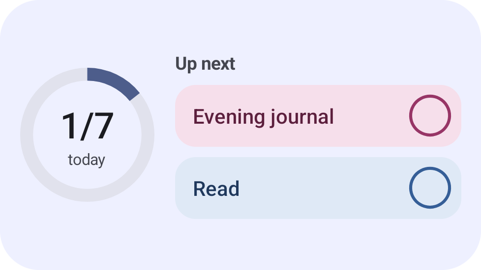
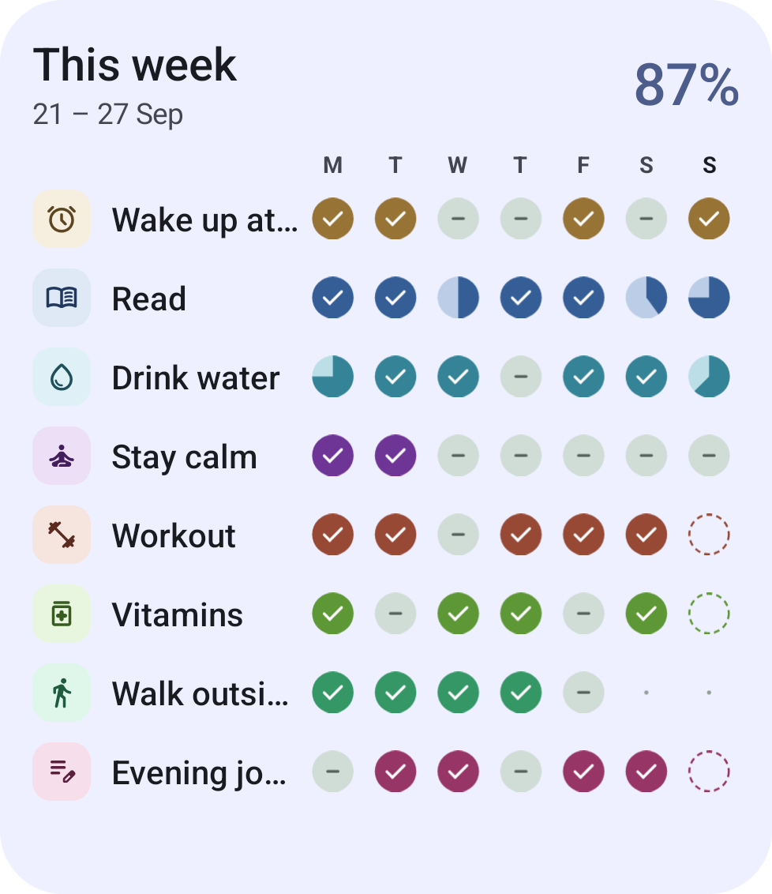
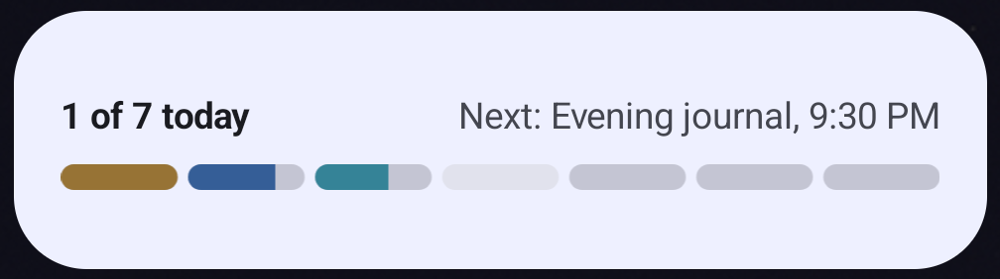
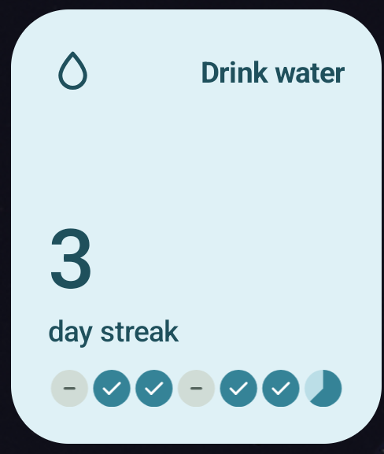

# Features

What Sprout does today, and where each part lives in the code. Paths are under `app/src/main/java/app/sprout/habits/`.

## Today

The home screen shows the date, a score card for today, and every habit scheduled for today.

A habit card has four looks: open (an empty circle), done (filled with the habit's color and a check), partial (filled as far as the amount goes, with a ring showing the percentage) and skipped (dimmed). Swipe right to mark it done, swipe left to skip it (a swipe has to drag the card past half its width, so scrolling never logs a habit), tap the circle to toggle done, and press and hold to log an amount, pick an outcome and add a note. Each change can be undone from the snackbar. Swiping the opposite way also undoes: swipe left on a done habit or right on a skipped one to clear it. The press-and-hold sheet has an Undo button when the day already has an entry. A done check-off card shows when it was logged ("Done at 6:52 AM"). Skipping a habit that asks for a note opens the sheet with the cursor in the note field.

Code: `ui/today/`, scoring in `domain/Scoring.kt`.

Every tab starts with the same header (`ui/components/TabHeader.kt`): the title, the date or date range under it, and 48 dp round buttons on the right. Other screens use the same round buttons (`HeaderIconButton`) for back, close, edit, archive and delete.

## Sample data

A fresh install starts with eight sample habits (from the designs), two weeks of history and notes on several days, in the app language (`data/SampleData.kt`). They're added only on the very first launch, never on an update or after a restore. A card on Today and a More → General row remove them (only the sample habits, with their entries and notes); their ids are kept in DataStore (`sampleHabitIds`). Sample habits have reminders only in debug builds.

## Habits

Habits are created and edited on one screen: name, icon (7 suggestions, or any of 29 in a searchable sheet), color, how it's tracked (Check off, or Measure: a target in any unit, like 20 pages, 8000 steps, 45 min or 7 h), the days it's scheduled, a reminder, whether to ask for a note after a skip, and whether it appears on widgets. Manage habits lets you drag to reorder, archive, restore and delete.

Measure habits have a step: how far − / + and the slider move when logging (1 page, 500 steps, 0.25 h). Before 1.1 there was a separate Duration type; the database migration and backup import turn those habits into Measure habits in "min" (step 5) or "h" (step 0.25).

The Habits tab has a Week view (seven day marks per habit, with arrows to earlier weeks; tap any past day to edit it in the same sheet as Today) and an Overall view (a 26-week heatmap per habit with its current and best streak). Tapping a habit opens its detail screen (round back, edit, archive and delete buttons in the header) with the days done this month, best streak, note count, a month calendar (tap a past day to edit it) and its notes.

Code: `ui/edit/`, `ui/manage/`, `ui/habits/`, `ui/detail/`, statistics in `domain/Stats.kt`.

## Journal and notes

A note belongs to one habit and one day. The Journal tab lists notes newest first, grouped by day; each note shows the habit, that day's outcome, when it was written, and the text. It opens on all notes. Chips under the title narrow it to the last 7 or 30 days, and the two buttons at the top open bottom sheets to pick other dates or one or more habits. A picked range and the picked habits show as chips too; ✕ on the range chip goes back to All and ✕ on the habit chip clears the habits. When nothing matches, the Journal says which filter is hiding the notes and offers "Show all notes". A button whose filter is on is tinted and gets a small dot. When you write a new note for a habit and day that already have one, that note opens so you add to it. Notes can be added from Today, the Journal, a habit's detail screen or the press-and-hold sheet, and edited or deleted later. Press and hold a note card in the Journal for a sheet with Edit note, Share and Delete note; deleting shows an Undo snackbar.

Code: `ui/journal/`, `ui/note/`.

## Insights

A summary for a range of dates: this week by default, the last 7 or 30 days from the chips under the title, or any range from the calendar button, for all habits or the ones you pick. It shows the average score with a bar per habit, your longest streak and the habit having its best week; a Patterns card with the weekday that goes best and the habit that dropped most against the range before; a bar per weekday (one per week for ranges over two weeks); and a card per habit with its days kept, streak, score and a colour ribbon that grows with consistency. Tapping a bar shows its numbers, and tapping a habit opens it. A past day with no entry counts as 0 in the score; only a day marked Skip is left out.

Code: `ui/insights/`.

## Reminders

Each habit can have one daily reminder on its scheduled days. The time is set in a sheet with hour and minute steppers (tap or hold the arrows, or drag a number) and an AM/PM switch on 12-hour phones (`ui/components/TimePickerSheet.kt`). The notification shows what's left for today and opens the habit when tapped. Reminders are exact when the user allows "Alarms & reminders", and otherwise arrive within 10 minutes. At 9 PM, habits that were skipped and ask for a note get a short prompt to add one.

Code: `notify/`, timing in `domain/ReminderTime.kt`.

## Widgets

Four home-screen widgets: This week (every habit with its week), Today (a progress ring and the next habits, with a circle to mark each done), Today strip (a slim bar per habit), and Streak (one habit's current streak and last seven days). They follow the phone's colors (wallpaper colors on Android 12+) and its light or dark mode, whatever the app's own theme is set to. They update after every change made in the app or on a widget, and show a light placeholder while loading instead of a blank box.

| Today | This week | Today strip | Streak |
| --- | --- | --- | --- |
|  |  |  |  |

Code: `widget/`.

## Backup

Everything, including preferences, can be exported to a JSON file and imported again through the system file picker. The app needs no storage permission. A CSV export opens in any spreadsheet.

Code: `data/backup/`, `ui/more/BackupSection.kt`.

## Settings

The More tab covers backup, the app language (English, Hindi, Spanish, German, French, Portuguese (Brazil), Japanese or the phone's language, applied at once), theme (system, light, dark), dynamic color or an accent color, font (system, Space Grotesk, Outfit, Lexend, Atkinson Hyperlegible), text size, the first day of the week, the default reminder time, notification settings and About.

Code: `ui/more/`, `data/SettingsRepository.kt`, `ui/theme/`, `AppLanguage.kt`; text in `res/values*/strings.xml`.

## Updates

The GitHub build checks GitHub Releases for a newer version: from About → Check for updates, and on its own at most once a day. A newer version shows the Update available dialog with up to five What's new lines from the release notes; Update downloads the APK with progress, checks it against the release's SHA256SUMS.txt and opens Android's installer (Android asks once to allow installs from Sprout). Later hides that version until the next one. More → About Sprout shows an "Update available" pill. The update dialog and the support prompt never show on the same launch. The F-Droid and Play builds have no checker; their stores update them. Once Sprout is listed on Google Play (`PLAY_LISTED` in `app/build.gradle.kts`), the Play build's About gets a Check for updates button that opens the store listing; until then it shows nothing there.

Code: `data/update/UpdateManager.kt`, `ui/update/UpdateUi.kt`, `domain/Versions.kt`; the permission and FileProvider are in `src/github/AndroidManifest.xml`.

## Support

About has a Sponsor link (not in the `play` build, where Google Play's payments policy rules it out; the support prompt drops its Sponsor button there too) and, in the `play` build once it is listed (`PLAY_LISTED`), a Rate on Play Store link; the support prompt offers the same button. The `foss` and `github` builds never link to Google Play. After a week of use and 30 check-ins, Sprout asks once whether you'd like to support it; it asks again after 60 days at most, and stops after two "Maybe later"s.

Code: `support/`, `ui/about/`.
